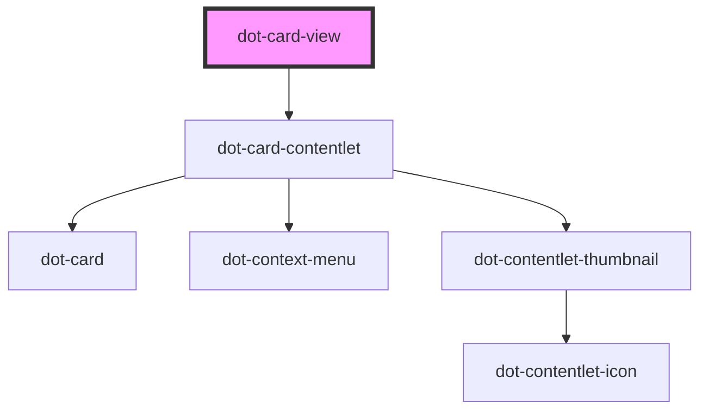

# dot-card-view

<!-- Auto Generated Below -->

## Properties

| Property | Attribute | Description | Type                      | Default     |
| -------- | --------- | ----------- | ------------------------- | ----------- |
| `items`  | --        |             | `DotCardContentletItem[]` | `[]`        |
| `value`  | `value`   |             | `string`                  | `undefined` |

## Events

| Event      | Description | Type               |
| ---------- | ----------- | ------------------ |
| `selected` |             | `CustomEvent<any>` |

## Methods

### `getValue() => Promise<DotContentletItem[]>`

#### Returns

Type: `Promise<DotContentletItem[]>`

## Dependencies

### Depends on

- [dot-card-contentlet](../../components/dot-card-contentlet)

### Graph

----------------------------------------------

*Built with [StencilJS](https://stenciljs.com/)*
