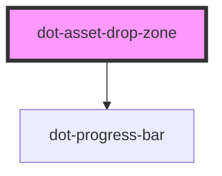

# dot-drop-zone

<!-- Auto Generated Below -->

## Properties

| Property                 | Attribute                    | Description                                                          | Type                                                                               | Default                                                                                                                                                                  |
| ------------------------ | ---------------------------- | -------------------------------------------------------------------- | ---------------------------------------------------------------------------------- | ------------------------------------------------------------------------------------------------------------------------------------------------------------------------ |
| `createAssetsText`       | `create-assets-text`         | Legend to be shown when creating dotAssets                           | `string`                                                                           | `'Creating DotAssets'`                                                                                                                                                   |
| `dialogLabels`           | --                           | Labels to be shown in error dialog                                   | `{ closeButton: string; uploadErrorHeader: string; dotAssetErrorHeader: string; }` | `{         closeButton: 'Close',         uploadErrorHeader: 'Uploading File Results',         dotAssetErrorHeader: '$0 out of $1 files fail on DotAsset creation'     }` |
| `dotAssetsURL`           | `dot-assets-u-r-l`           | URL to endpoint to create dotAssets                                  | `string`                                                                           | `'/api/v1/workflow/actions/default/fire/NEW'`                                                                                                                            |
| `dropFilesText`          | `drop-files-text`            | Legend to be shown when dropping files                               | `string`                                                                           | `'Drop Files to Upload'`                                                                                                                                                 |
| `maxFileSize`            | `max-file-size`              |                                                                      | `string`                                                                           | `''`                                                                                                                                                                     |
| `multiMaxSizeErrorLabel` | `multi-max-size-error-label` | Error to be shown when try to upload a bigger size file than allowed | `string`                                                                           | `'One or more of the files exceeds the maximum file size'`                                                                                                               |
| `singeMaxSizeErrorLabel` | `singe-max-size-error-label` | Error to be shown when try to upload a bigger size file than allowed | `string`                                                                           | `'The file exceeds the maximum file size'`                                                                                                                               |
| `uploadFileText`         | `upload-file-text`           | Legend to be shown when uploading files                              | `string`                                                                           | `'Uploading Files...'`                                                                                                                                                   |

## Events

| Event            | Description                                               | Type                      |
| ---------------- | --------------------------------------------------------- | ------------------------- |
| `uploadComplete` | Emit an array of response with the DotAssets just created | `CustomEvent<Response[]>` |

## Dependencies

### Depends on

- [dot-progress-bar](../../../elements/dot-progress-bar)

### Graph

----------------------------------------------

*Built with [StencilJS](https://stenciljs.com/)*
