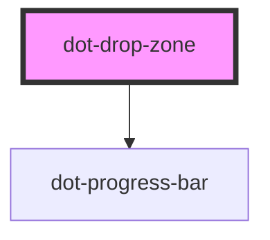

# dot-drop-zone

<!-- Auto Generated Below -->

## Properties

| Property        | Attribute         | Description                                   | Type     | Default                           |
| --------------- | ----------------- | --------------------------------------------- | -------- | --------------------------------- |
| `assetsURL`     | `assets-u-r-l`    | URL to endpoint to register multipart files   | `string` | `'/api/v1/workflow/actions/fire'` |
| `dropFilesText` | `drop-files-text` | Legend to be shown when dropping files        | `string` | `'Drop Files to Upload'`          |
| `uploadURL`     | `upload-u-r-l`    | URL of the endpoint to upload temporary files | `string` | `'/api/v1/temp/'`                 |

## Dependencies

### Depends on

- [dot-progress-bar](../../../elements/dot-progress-bar)

### Graph

----------------------------------------------

*Built with [StencilJS](https://stenciljs.com/)*
