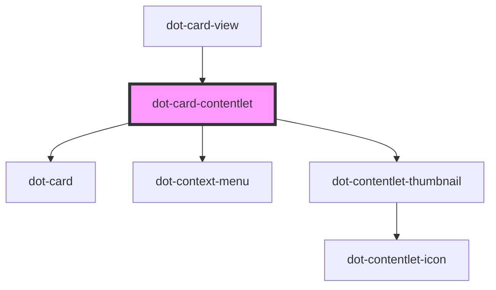

# dot-card-contentlet

<!-- Auto Generated Below -->

## Properties

| Property  | Attribute | Description | Type                    | Default     |
| --------- | --------- | ----------- | ----------------------- | ----------- |
| `checked` | `checked` |             | `boolean`               | `undefined` |
| `item`    | --        |             | `DotCardContentletItem` | `undefined` |

## Events

| Event         | Description | Type                                  |
| ------------- | ----------- | ------------------------------------- |
| `valueChange` |             | `CustomEvent<DotCardContentletEvent>` |

## Dependencies

### Used by

 - [dot-card-view](../../collections/dot-card-view)

### Depends on

- [dot-card](../../elements/dot-card)
- [dot-context-menu](../dot-context-menu)
- [dot-contentlet-thumbnail](../../elements/dot-contentlet-thumbnail)

### Graph

----------------------------------------------

*Built with [StencilJS](https://stenciljs.com/)*
