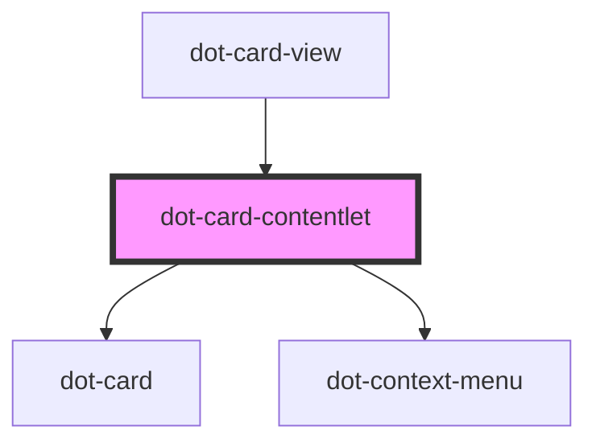

# dot-card-contentlet

<!-- Auto Generated Below -->

## Properties

| Property | Attribute | Description | Type                    | Default     |
| -------- | --------- | ----------- | ----------------------- | ----------- |
| `item`   | --        |             | `DotCardContentletItem` | `undefined` |

## Events

| Event      | Description | Type               |
| ---------- | ----------- | ------------------ |
| `selected` |             | `CustomEvent<any>` |

## Dependencies

### Used by

 - [dot-card-view](../../collections/dot-card-view)

### Depends on

- [dot-card](../../elements/dot-card)
- [dot-context-menu](../dot-context-menu)

### Graph

----------------------------------------------

*Built with [StencilJS](https://stenciljs.com/)*
