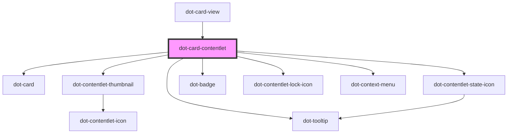

# dot-card-contentlet

<!-- Auto Generated Below -->

## Properties

| Property  | Attribute | Description | Type                    | Default     |
| --------- | --------- | ----------- | ----------------------- | ----------- |
| `checked` | `checked` |             | `boolean`               | `undefined` |
| `item`    | --        |             | `DotCardContentletItem` | `undefined` |

## Events

| Event            | Description | Type                                  |
| ---------------- | ----------- | ------------------------------------- |
| `checkboxChange` |             | `CustomEvent<DotCardContentletEvent>` |

## Dependencies

### Used by

 - [dot-card-view](../../collections/dot-card-view)

### Depends on

- [dot-card](../../elements/dot-card)
- [dot-contentlet-thumbnail](../../elements/dot-contentlet-thumbnail)
- [dot-tooltip](../../elements/dot-tooltip)
- [dot-contentlet-state-icon](../../elements/dot-contentlet-state-icon)
- [dot-badge](../../elements/dot-badge)
- [dot-contentlet-lock-icon](../../elements/dot-contentlet-lock-icon)
- [dot-context-menu](../dot-context-menu)

### Graph

----------------------------------------------

*Built with [StencilJS](https://stenciljs.com/)*
