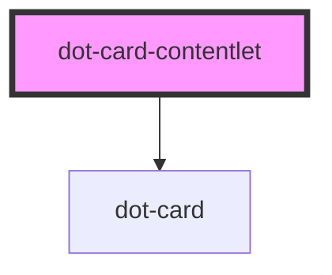

# dot-card-contentlet

<!-- Auto Generated Below -->

## Properties

| Property     | Attribute    | Description | Type  | Default     |
| ------------ | ------------ | ----------- | ----- | ----------- |
| `contentlet` | `contentlet` |             | `any` | `undefined` |

## Events

| Event      | Description | Type               |
| ---------- | ----------- | ------------------ |
| `selected` |             | `CustomEvent<any>` |

## Dependencies

### Depends on

- [dot-card](../../elements/dot-card)

### Graph

----------------------------------------------

*Built with [StencilJS](https://stenciljs.com/)*
