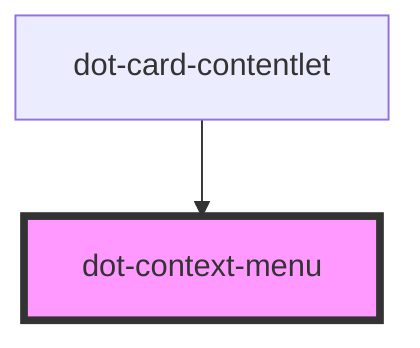

# dot-context-menu

<!-- Auto Generated Below -->

## Properties

| Property  | Attribute | Description | Type                                 | Default |
| --------- | --------- | ----------- | ------------------------------------ | ------- |
| `options` | --        |             | `DotContextMenuOption<MenuAction>[]` | `[]`    |

## Dependencies

### Used by

 - [dot-card-contentlet](../dot-card-contentlet)

### Graph

----------------------------------------------

*Built with [StencilJS](https://stenciljs.com/)*
