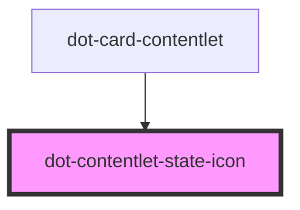

# dot-contentlet-state-icon

<!-- Auto Generated Below -->

## Properties

| Property     | Attribute | Description | Type                                                                        | Default                                                                                                                      |
| ------------ | --------- | ----------- | --------------------------------------------------------------------------- | ---------------------------------------------------------------------------------------------------------------------------- |
| `contentlet` | --        |             | `DotContentletItem`                                                         | `undefined`                                                                                                                  |
| `labels`     | --        |             | `{ archived: string; published: string; revision: string; draft: string; }` | `{         archived: 'Archived',         published: 'Published',         revision: 'Revision',         draft: 'Draft'     }` |
| `size`       | `size`    |             | `string`                                                                    | `'16px'`                                                                                                                     |

## Dependencies

### Used by

 - [dot-card-contentlet](../../components/dot-card-contentlet)

### Graph

----------------------------------------------

*Built with [StencilJS](https://stenciljs.com/)*
