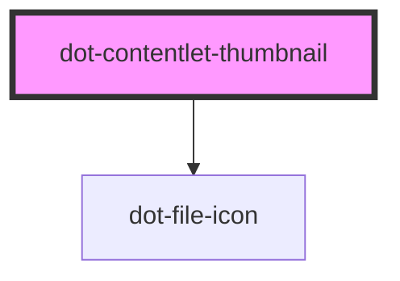

# dot-contentlet-thumbnail

<!-- Auto Generated Below -->

## Properties

| Property     | Attribute | Description | Type            | Default     |
| ------------ | --------- | ----------- | --------------- | ----------- |
| `alt`        | `alt`     |             | `string`        | `''`        |
| `contentlet` | --        |             | `DotContentlet` | `undefined` |
| `height`     | `height`  |             | `string`        | `''`        |
| `width`      | `width`   |             | `string`        | `''`        |

## Dependencies

### Depends on

- [dot-file-icon](../dot-file-icon)

### Graph

----------------------------------------------

*Built with [StencilJS](https://stenciljs.com/)*
