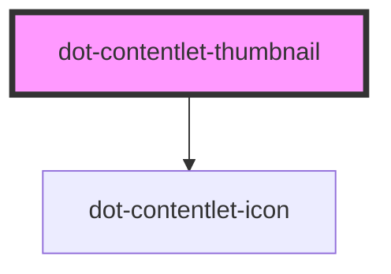

# dot-contentlet-thumbnail

<!-- Auto Generated Below -->

## Properties

| Property     | Attribute   | Description | Type                | Default     |
| ------------ | ----------- | ----------- | ------------------- | ----------- |
| `alt`        | `alt`       |             | `string`            | `''`        |
| `contentlet` | --          |             | `DotContentletItem` | `undefined` |
| `height`     | `height`    |             | `string`            | `''`        |
| `iconSize`   | `icon-size` |             | `string`            | `''`        |
| `width`      | `width`     |             | `string`            | `''`        |

## Dependencies

### Depends on

- [dot-contentlet-icon](../dot-contentlet-icon)

### Graph

----------------------------------------------

*Built with [StencilJS](https://stenciljs.com/)*
