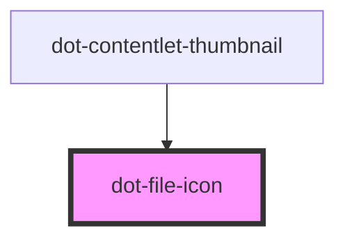

# dot-file-icon

<!-- Auto Generated Below -->

## Properties

| Property | Attribute | Description | Type     | Default |
| -------- | --------- | ----------- | -------- | ------- |
| `icon`   | `icon`    |             | `string` | `''`    |

## Dependencies

### Used by

 - [dot-contentlet-thumbnail](../dot-contentlet-thumbnail)

### Graph

----------------------------------------------

*Built with [StencilJS](https://stenciljs.com/)*
